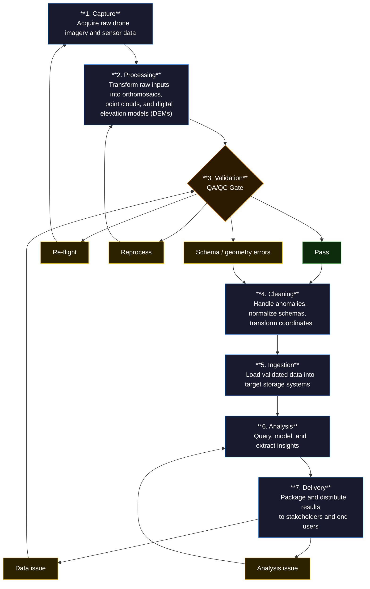

# PigeonSight Workflow Diagram

## Routing Rules

- Stages advance only when all **blocking** QA criteria are met.
- Failures route back to the **earliest stage** where the root cause can be fixed — not necessarily the prior stage.
- **Pass** — All blocking QA criteria met; workflow advances to Cleaning
- **Re-flight** — Coverage gap detected; dataset is incomplete and requires a new flight
- **Reprocess** — Processing artifact or CRS error; raw imagery is valid but processing must be repeated
- **Schema / geometry errors** — Data can be corrected without reprocessing; routes to Cleaning
- **Data issue** — Delivery rejected due to upstream data quality; returns to Validation
- **Analysis issue** — Delivery rejected due to analytical error; returns to Analysis
- **Advisory** findings are documented but do not block progression
