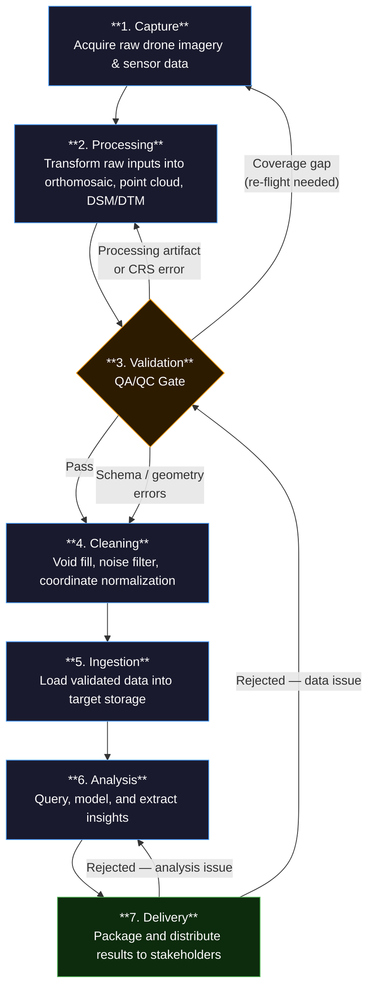

# PigeonSight Workflow Diagram

## Routing Rules

- Stages advance only when all **blocking** QA criteria are met.
- Failures route back to the **earliest stage** where the root cause can be fixed — not necessarily the prior stage.
- The **Validation gate** (Stage 3) is the primary checkpoint. It can route back to Stage 1 (re-flight) or Stage 2 (reprocess) depending on the failure type, or forward to Stage 4 for issues that cleaning can resolve.
- **Advisory** findings are documented but do not block progression.
